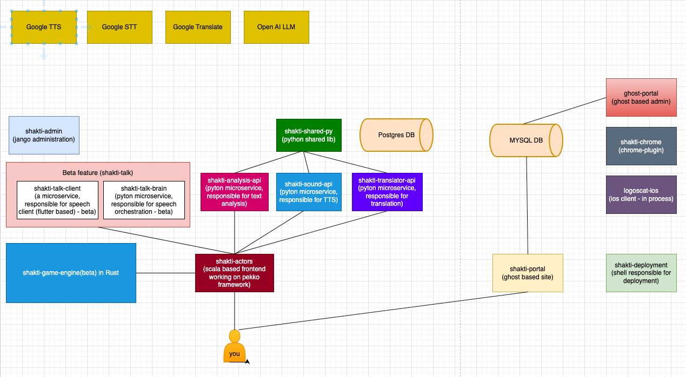

## LogosCat - Polyglot Workspace - Learn language by reading, listening, translating, analyzing, using AI tools

## What is LogosCat? 

There are many ways to learn a language — read <a href="https://portal.logoscat.com/finding-your-path-to-fluency/" target="_blank">this</a> if you're still exploring which approach works best for you.
LogosCat is for people learning while reading books/articles, listening, concentrating on hard parts, analyzing texts and expanding vocabulary.
LogosCat is for people who love languages.

LogosCat.com is a polyglot workspace for people who learn languages by reading and listening to ebooks or web content.

It provides a rich set of tools to translate and extract meaning, recognize pronunciation, memorize vocabulary, and analyze difficult parts of a text in multiple ways.

LogosCat also includes a sophisticated analytical layer that suggests what the user should do next based on their learning outcomes and progress.

The platform currently supports 30 human languages and is built using Google APIs, OpenAI, Scala, Python, and Docker (specialized microservices) — with a full monitoring stack running behind the scenes.

Yes, it is a hobby project — but I have never seen anything comparable for people learning languages through reading real books, listening to speech and seriously working on vocabulary memorization. 

Use desktop version to get the best out of it daily. Use mobile to recap while traveling..

Using the desktop version, you can upload PDF or EPUB files into your LC workspace and read them seamlessly.
With the Chrome plugin, you can bring web content directly into your LC workspace and read it there.

This is a new kind of reading experience: you don’t just translate — you can analyze any part of the text as deeply as you want. You can also listen to what you read, activating the auditory pathways of your brain.

A rich set of features, all focused on one goal: improving your proficiency in a foreign language.

## LogosCat architecture?

A part of it...to get a taste...

# Overview

**LogosCat** is a multi-language learning platform.

Its backend and UIs live in the **shakti-actors** Scala application, which coordinates several Python microservices for translation, text-to-speech, and text analysis.

All deployment, Docker setup, and orchestration live in **shakti-deployment**.

# Central Hub: shakti-actors

**shakti-actors** is a Scala application built on **Akka (Pekko) Typed** and **Akka HTTP**.

It acts as the main web server, serves static UIs, and orchestrates work across the other services.

It serves:

- The main workspace (desktop and mobile variants)
- The memorize (vocabulary practice) page
- Recap, stories, library, and other learning pages
- Static assets and HTML/JS/CSS

HTTP routes are defined in **UIActor** and **StaticRouteHandler**.

Each feature (translation, TTS, analysis, history, etc.) has its own handler that validates the request, talks to the right service, and returns the response.

# Python Microservices

Three Python services handle core logic:

- **shakti-translator-api** — Translation between supported languages. **shakti-actors** calls it for translation and gets structured results (word-level, sentence-level, etc.).
- **shakti-sound-api** — Text-to-speech. Requests specify text and language; the service returns or stores audio, and **shakti-actors** caches results to avoid repeated calls.
- **shakti-analysis-api** — Text analysis for morphological and etymological explanations. **shakti-actors** forwards selected text and gets HTML-formatted results.

Each Python service is focused on its task.

**shakti-actors** does validation, session handling, caching, and persistence.

Inter-service calls use HTTP, with authentication between services as configured in deployment.

# Database and Data Persistence

**PostgreSQL** holds user and learning data.

**shakti-actors** owns the schema and migrations (in its migration scripts) and uses **Slick** for access.

Main data categories:

- Users and authentication-related data
- `work_history_items` — Translation, analysis, and TTS outputs linked to the user and workspace session
- Memorization data (for example, words, hard words, learning events)
- Stories, library/book metadata, positions
- Voices, supported languages, and similar configuration

Analysis results and TTS outputs are stored in history so users can re-read them, replay audio, and use them for vocabulary practice.

# Learning and Memorization

There is a learning subsystem for vocabulary practice:

- **Learning events** — User actions (for example, translating, marking known words, viewing context) are recorded as events.
- **Memorization** — Words and their contexts are stored and used to build practice sessions.
- **Projection** — Events are processed and projected into memorization tables (for example, `memorization_words`, `hard_words`) for efficient retrieval.
- **Session and hub modes** — Practice can be tied to a specific recap session or a global “hub” of hard words across the user’s history.

The memorize page fetches words from the memorization APIs and lets users practice (“I know this”, “Skip”), with optional TTS and context from history.

The **Word history** section shows past occurrences from the history search (yesterday/recall) so users can see how a word was used before.

# History Search (Yesterday Mode)

**Yesterday** is a history search feature.

Users search by words and language to find past translations, analyses, and TTS outputs.

It uses PostgreSQL full-text search on `work_history_items` and returns paginated pages with items (input, output, analysis, audio) grouped by date.

This logic is shared by the main workspace and the memorize page.

# Chrome Extension

A separate Chrome extension connects to the Shakti backend.

It is not part of **shakti-deployment** and is built independently, but it uses the same backend APIs (with proper configuration) to support reading and translation workflows inside the browser.

# Administration: shakti-admin

**shakti-admin** is a Django application for administrative tasks.

It manages users, configuration, and platform data, and is deployed as part of the platform stack.

# Talk-brain (Beta)

shakti-talk-brain is the conversation “brain” for the Shakti language-learning stack. 
It’s built around LangGraph: each conversation variant is a StateGraph of nodes and conditional edges. 
The service compiles one graph per version (build_graph()), invokes it per user turn with ainvoke(), 
and persists state between turns outside the graph. So it’s LangGraph at the core—stateful, multi-node conversation workflows 
(init, extraction, drill, iteration, normal chat, safe fallback) with validated routing and one LLM call per turn where applicable.

# Deployment

**shakti-deployment** manages:

- Docker Compose setups for all services
- Nginx as reverse proxy and SSL termination
- Database initialization and migrations
- SSL certificates (for example, Let’s Encrypt) for production
- A local/dev mode that runs without SSL and with volume mounts for development

All deployment scripts and Docker configuration live in **shakti-deployment**; individual apps focus on their own logic.

# Real-Time Updates

**Server-Sent Events (SSE)** are used for real-time updates.

For example, TTS progress and story generation status are pushed to the client.

Sessions are identified so updates reach the right user.

# Tracing and Observability

Requests are expected to carry `userId` and `traceId` through the system.

Logging uses a structured format (for example, JSON) to support monitoring and troubleshooting without exposing sensitive data.

**shakti-deployment** includes **Grafana**, **Promtail**, and related monitoring components.

# Summary

LogosCat uses a **hub-and-spoke** layout:

- **shakti-actors** hosts UIs and orchestrates translation, TTS, and analysis via Python microservices
- **PostgreSQL** stores user and learning data
- A learning/memorization subsystem drives vocabulary practice
- Deployment, SSL, and monitoring are centralized in **shakti-deployment**
- **shakti-admin** handles administration
- A Chrome extension extends the experience into the browser

## LogosCat maintained by creator in a closed repo 
To participate in the project: 

1) <a href="https://portal.logoscat.com/" target="_blank">register</a>  and try it   
2) conceive an idea
3) send an e-mail to support@logoscat.com, describing your idea and a plan to implement it

## Steps to Get Started

1. Install our browser <a href="https://chromewebstore.google.com/detail/logos-cat/aklfcdihgeiljeiachkibmhkbbodebid" target="_blank">plugin</a>  to copy texts from the web
2. Add <a href="https://portal.logoscat.com/library/" target="_blank">books</a> (PDF or EPUB) to your library
3. <a href="https://portal.logoscat.com/setup-your-languages/" target="_blank">Set up</a> your input and output languages 
4. <a href="https://portal.logoscat.com/how-to-translate/" target="_blank">Start translating</a>
5. <a href="https://portal.logoscat.com/analyze-hard-parts/" target="_blank">Try the Analyze feature</a> — also see <a href="https://portal.logoscat.com/free-prompt-analysis/" target="_blank">this cute analysis option</a>
6. <a href="https://portal.logoscat.com/listening/" target="_blank">Listen to your texts</a>
7. <a href="https://portal.logoscat.com/generate-story-with-audio/" target="_blank">Generate a story with audio using AI</a>
8. <a href="https://portal.logoscat.com/yesterday/" target="_blank">Use Yesterday</a> to review recent vocabulary and use <a href="https://portal.logoscat.com/word-memorization/" target="_blank">a memorizing hard words</a> feature.
9. Always use <a href="https://portal.logoscat.com/recap/" target="_blank">Recap</a>
10. <a href="https://portal.logoscat.com/word-grabber/" target="_blank">Use Words Grabber</a> - to focus on some words
11. Having trouble? Go to **Settings → Report Issue**
12. Need to top up? Go to **Settings → Balance**

